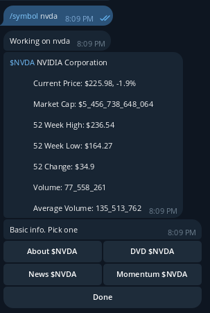
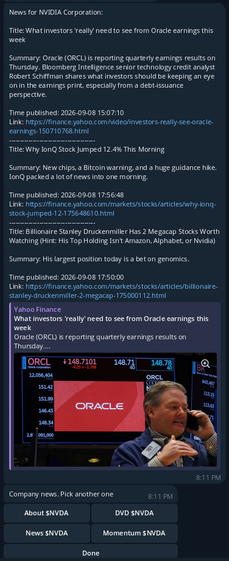

### Telegram bot for quickly checking what’s going on the stock market.

Bot uses python yfinance library.
Once you provide a command and a ticker then it responses with very basic data about the given company and few more options like: about company, last dividend and return in a few different periods of time.

<<<<<<< HEAD


I personally most often use it for the latest news


=======


I personally most often use it for the latest news




---
### Steps to set up the app:
```
git clone https://github.com/paulmarketandtech/ticker_screener.git 
cd ticker_screener 
```

In the Telegram app talk to @BotFather . create a new bot and copy its token.
Paste the token to .env.example in TOKEN field, save and remove the .example extension

Note: you have to do a small tweak over here. By default it will work in a private chat but it was designed for working in a supergroup. If you’re planning to use it in a group then provide real values in the selected_room.json.example and remove the .example extension.
If you just want to use it in a private chat then just remove the .example extension.

```
docker compose build
docker compose up -d 
```

And go talking to your bot! 
After initial msg do:
/symbol ticker 
Example:
/symbol nvda 

After 40 seconds of no action the session should expire and you have to start a new one. 
>>>>>>> ef67ad7ee1bfa30f2f1a174469eff23d35acf4ec

